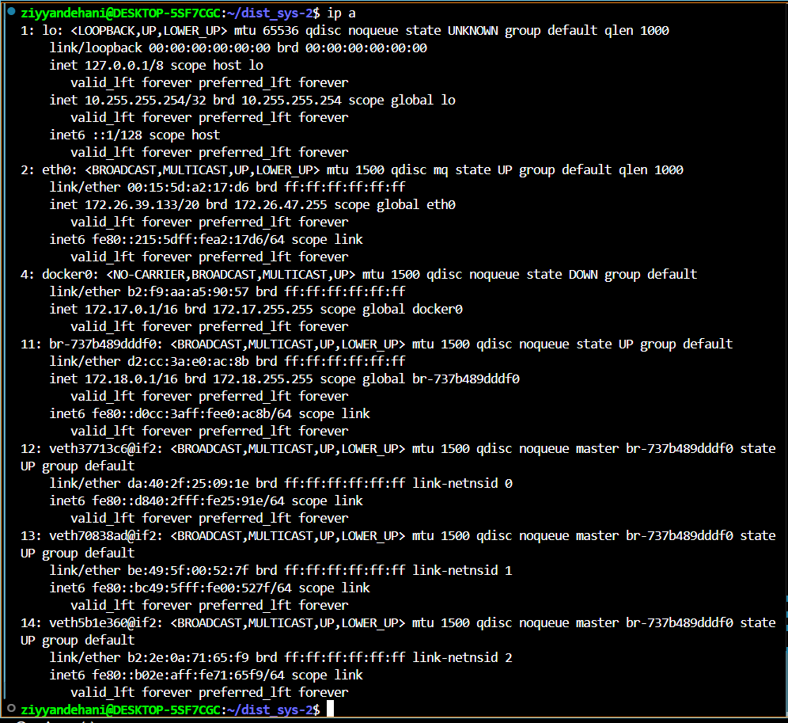

# MQTT Project
## Cara Menjalankan

1. Jalankan service MQTT:
   ```bash
    docker compose -f compose/mqtt.yml up -d


Perintah ini digunakan untuk membuat dan menyalakan container MQTT (publisher dan subscriber) secara background.

2. Mengecek network interface Docker
Setelah itu saya jalankan:
    ```bash
     ip a


Dari sini terlihat bahwa Docker membuat sebuah jembatan jaringan (bridge) baru. Alamat bridge inilah yang nantinya dipakai untuk melakukan capture trafik dengan tcpdump.

3. 


